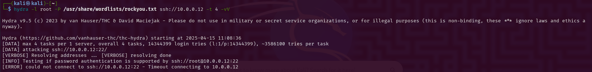
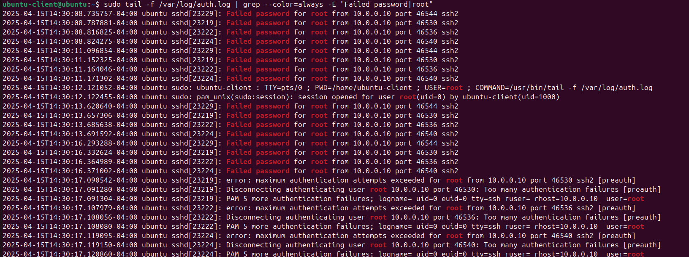

## 🔐 Day #5: SSH Brute Force Detection – Linux Auth Log Analysis


## 🎯 Objective

Simulate an SSH brute force attack using Hydra from a Kali Linux machine and detect the attack by analyzing authentication logs (/var/log/auth.log) on an Ubuntu Linux server.

## 🛠️ Lab Setup

| Role        | System        | Details                  |
| ----------- | ------------- | ------------------------ |
| 🔹 Attacker | Kali Linux    | Hydra tool installed     |
| 🔸 Victim   | Ubuntu Server | OpenSSH enabled, rsyslog |


## ✅ Tools Used

- hydra – brute force tool (attacker)

- openssh-server – SSH service (target)

- /var/log/auth.log – log file for authentication events

## 🧠 What Is an SSH Brute Force Attack?

A brute force attack repeatedly attempts different username-password combinations to gain access via SSH. If successful, the attacker gains shell access and can escalate privileges, move laterally, or exfiltrate data.

## ⚔️ Step-by-Step Instructions

🔹 On Ubuntu (Target Machine)

Install and Enable SSH:
```bash
sudo apt update
sudo apt install openssh-server -y
sudo systemctl enable ssh
sudo systemctl start ssh
```
Verify IP Address:
```bash
ip a
```
🔸 On Kali (Attacker Machine)

Ensure Hydra Is Installed:
```bash
sudo apt install hydra -y
```
Run SSH Brute Force:
```bash
hydra -l root -P /usr/share/wordlists/rockyou.txt ssh://<TARGET-IP> -t 4 -vV
```
## 🔍 Detect Brute Force via Auth Logs (on Ubuntu)

Check Failed SSH Logins:
```bash
sudo grep "Failed password" /var/log/auth.log
```
Find Attempted Usernames:
```bash
sudo grep "Failed password" /var/log/auth.log | awk '{print $(NF-5)}' | sort | uniq -c | sort -nr
```
Find Source IPs:
```bash
sudo grep "Failed password" /var/log/auth.log | awk '{print $(NF-3)}' | sort | uniq -c | sort -nr
```
Live Monitor Auth Logs:
```bash
sudo tail -f /var/log/auth.log
```
## 📸 Screenshot Evidence

- ✅ Repeated failed login attempts from the same IP

- ✅ Usernames targeted (e.g., root)

 📷 Insert screenshots here or link to images folder

 - 🔐 **Hydra Brute Force Output**
  

- 🚫 **Failed SSH Login Attempts**
  

## ✅ Conclusion

- Detection: Multiple failed SSH login attempts detected from single IP using /var/log/auth.log

- Attack Pattern: Brute force against root user using Hydra

- Prevention Tip: Use fail2ban, disable root login, and enable SSH key authentication

## 💡 Bonus: Hardening Tips

- Disable Root Login:
```bash
sudo nano /etc/ssh/sshd_config
# PermitRootLogin no
```
- Use SSH Key Authentication:
```bash
# PasswordAuthentication no
```
- Change SSH Port:
```bash
# Port 2222
```
- Enable UFW and Fail2Ban:
```bash
sudo apt install fail2ban -y
sudo systemctl start fail2ban
sudo ufw allow 2222/tcp
sudo ufw enable
```
## 📚 References

Hydra GitHub: https://github.com/vanhauser-thc/thc-hydra

Ubuntu UFW Logs: https://wiki.ubuntu.com/UncomplicatedFirewall

SSH Security Best Practices: https://infosec.mozilla.org/guidelines/openssh.html
